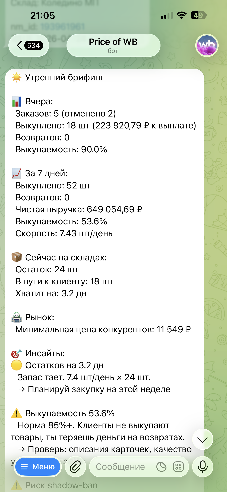
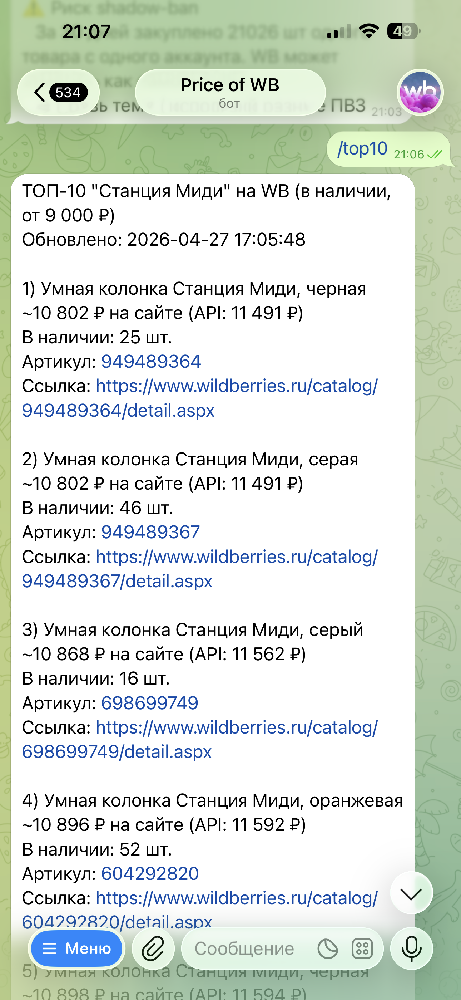
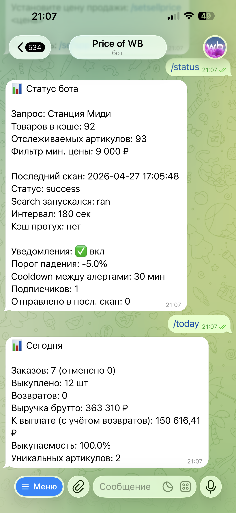
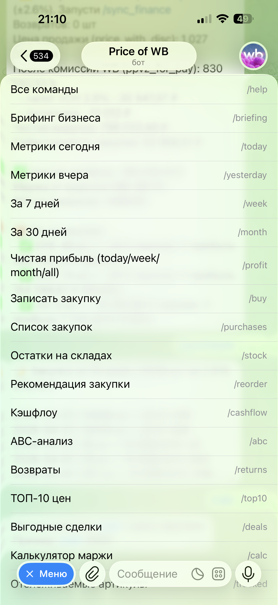
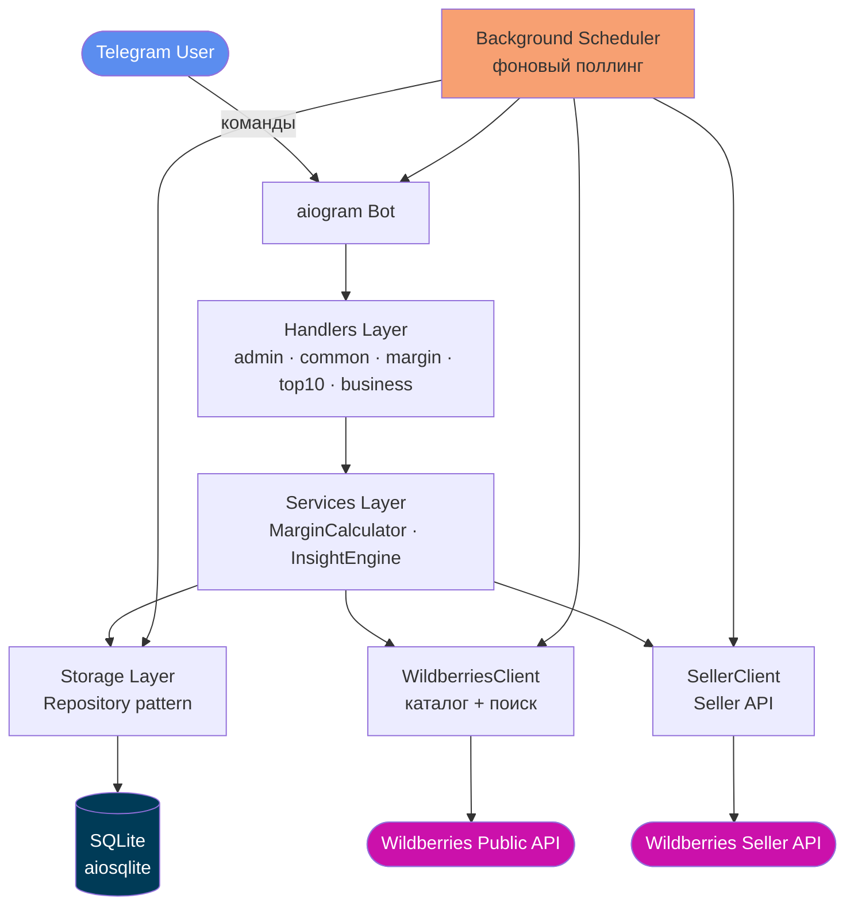

<div align="center">


# 📊 WB Price Tracker Bot

[](https://t.me/refusned)

**Telegram-бот для мониторинга цен и аналитики продаж на Wildberries.**
Фоновый поллинг каталога, алерты падения цены, маржинальный калькулятор,
учёт закупок, аналитика собственных продаж через WB Seller API.

[](https://www.python.org/)
[](https://docs.aiogram.dev/)
[](https://www.docker.com/)
[](https://docs.pytest.org/)
[](LICENSE)

</div>

---

## 📸 Демо

<table>
  <tr>
    <td align="center" width="33%">
      <b>Утренний брифинг</b><br/>
      <sub><code>/briefing</code></sub><br/>
      
    </td>
    <td align="center" width="33%">
      <b>Топ-10 цен</b><br/>
      <sub><code>/top10</code></sub><br/>
      
    </td>
    <td align="center" width="33%">
      <b>Статус и метрики</b><br/>
      <sub><code>/status</code> · <code>/today</code></sub><br/>
      
    </td>
  </tr>
</table>

<details>
<summary><b>📋 Полное меню команд</b></summary>

<p align="center">
  
</p>

</details>

> Бот живёт в Telegram и работает 24/7 в Docker-контейнере на VPS.

---

## 🚀 Возможности

### Мониторинг рынка
- Фоновый поллинг каталога Wildberries с настраиваемым интервалом
- Поиск по нескольким вариантам запроса с дедупликацией результатов
- Кэш товаров с TTL и **историей цен** (timeseries в SQLite)
- Алерты в Telegram при падении цены ниже заданного порога
- Защита от спама: дедупликация и rate-limiting на алерты
- `/top10` — топ дешевейших товаров категории
- Отслеживание конкретных артикулов (`/track`, `/tracked`)

### Маржинальный калькулятор
- Учёт **СПП** (скидки постоянного покупателя), комиссии WB, логистики, хранения, возвратов
- Расчёт ROI и target margin по конкретной закупочной цене
- Конфигурация через env или интерактивно через `/setspp`, `/setlogistics`, `/settax`
- ABC-анализ ассортимента (`/abc`)

### Аналитика продаж (WB Seller API)
- Интеграция с **Seller Statistics API** (опционально)
- Ежедневный брифинг продаж в назначенное время (`/briefing`)
- Срезы за день/вчера/неделю/месяц (`/today`, `/yesterday`, `/week`, `/month`)
- Расчёт чистой прибыли с учётом налогов, эквайринга, логистики (`/profit`)
- Учёт остатков FBS/FBO (`/stock`, `/stock_fbs`)
- Финансовая сводка и cashflow (`/finance`, `/cashflow`)
- 🤖 **LLM-разбор кабинета** с советами по продажам (`/advice`)

### 🤖 LLM-контур (Ollama Cloud, три фазы)

LLM — **Ollama Cloud** (`deepseek-v4-pro` по умолчанию); модель/база
настраиваются через env, поддержан и локальный Ollama.

**Фаза 1 — автоответы на отзывы и вопросы**
- Фоновый цикл опрашивает **неотвеченные отзывы и вопросы** покупателей через
  WB Feedbacks API и **сам публикует** ответы, сгенерированные LLM
- **Идемпотентность и аудит**: один отзыв = один ответ; владельцу приходит DM
  с текстом каждого опубликованного ответа
- Защита на уровне промпта: модели запрещено выдумывать сроки/гарантии/возвраты
- Под флагом `FEEDBACK_AUTO_REPLY_ENABLED` (по умолчанию выключено)

**Фаза 2 — советник по кабинету (`/advice`)**
- Разовый LLM-разбор кабинета: сводка продаж, остатки, возвраты → конкретные
  советы (read-only, ничего не меняет)

**Фаза 3 — интерактивный ИИ-ассистент (кнопка «🤖 Ассистент» / `/chat`)**
- Полноценный **агентский цикл с tool-use**: 15 инструментов — сводки продаж,
  P&L, воронка, остатки, возвраты, неотвеченные отзывы, настройки,
  самодиагностика бота (`get_bot_health`)
- Агент **проверяет и чинит** кабинет: может предложить закупку, ответ
  покупателю или изменение **любой из 13 настроек** (налог, СПП, целевая цена,
  пороги алертов…)
- **Money-safety by construction**: сам агент ничего не мутирует — каждое
  действие исполняется только по **HMAC-подписанной** inline-кнопке владельца
- Диалоговая история в SQLite, защита от prompt-injection (запрос владельца и
  тексты отзывов — данные, не инструкции)

### 🎯 Арбитраж-сканер (опционально)
- Автономный сканер **связок купить-дешевле/продать-дороже** по своим поисковым
  запросам: когорты из выдачи, P25/медиана, маржа с учётом комиссии, логистики,
  СПП и кошелька WB
- Личные **СПП-наблюдения** (композит vs wallet-only карантин), категорийная
  аналитика, дневные лимиты алертов и кулдауны
- Управление прямо из Telegram: `/arb` — меню, запросы, ключевые слова, связки
- Под флагом `ARBITRAGE_ENABLED` (нужен `WB_SELLER_API_KEY`)

### Production-ready
- Полностью **async/await** — никаких блокирующих вызовов в hot path
- **Rate limiter + exponential backoff** для устойчивости к 429/5xx
- Repository-паттерн для работы с SQLite (миграции, типизированные модели)
- Граф-разделение запросов: `WildberriesClient` (каталог) и `SellerClient` (Seller API)
- **Docker + docker-compose** деплой одной командой
- Юнит-тесты на критичные слои: парсинг, маржа, алерты, фильтрация

---

## 🛠️ Технологический стек

| Слой | Технология |
|------|------------|
| Язык | Python 3.11 (asyncio, type hints) |
| Telegram | [aiogram 3.7](https://docs.aiogram.dev/) |
| HTTP-клиент | [aiohttp](https://docs.aiohttp.org/) с `certifi` SSL-context |
| База данных | SQLite через [aiosqlite](https://github.com/omnilib/aiosqlite) |
| LLM | [Ollama Cloud](https://ollama.com) (`deepseek-v4-pro`), нативный `/api/chat` + tool-use |
| Конфиг | `python-dotenv` + `dataclass`-config |
| Тесты | `pytest 8.0+` (270+ тестов) |
| Контейнеризация | Docker + docker-compose |

---

## 🏗️ Архитектура



**Ключевые архитектурные решения:**

- 🧩 **Слоистая архитектура** (`handlers → services → storage → wb`) — явная граница ответственности, инверсия зависимостей через DI в `main.py`
- 📦 **Repository-паттерн** для всей работы с SQLite — `ItemRepository`, `PriceHistoryRepository`, `SubscriberRepository`, `BusinessRepository` и др.
- ⚡ **Async всё** — `aiosqlite` вместо синхронного sqlite3, `aiohttp` для HTTP, `asyncio.Lock` для rate-limiting
- 🛡️ **Resilience by design** — exponential backoff в `retry_async`, отдельные rate-limiter'ы для search-API и card-API (разные лимиты у WB)
- 🔄 **Independent scheduler** — фоновая задача обновления и алертов изолирована от Telegram event loop
- 🏷️ **Typed config** — `AppConfig` как `dataclass(slots=True)` с валидацией в `load_config()`

---

## 💬 Команды бота

<details>
<summary><b>Базовые</b></summary>

| Команда | Описание |
|---------|----------|
| `/start` | Приветствие и краткая справка |
| `/help` | Полный список команд |
| `/status` | Статус мониторинга, кэша и фоновой задачи |

</details>

<details>
<summary><b>Поиск и отслеживание товаров</b></summary>

| Команда | Описание |
|---------|----------|
| `/top10` | Топ-10 дешевейших товаров категории |
| `/track <артикул>` | Добавить артикул в отслеживание |
| `/tracked` | Список отслеживаемых артикулов |
| `/untrack <артикул>` | Убрать артикул из отслеживания |
| `/untrack_all` | Очистить все отслеживания |
| `/rescan` | Принудительное обновление каталога |
| `/find_deal` | Поиск товара ниже целевой цены |

</details>

<details>
<summary><b>Маржинальный калькулятор</b></summary>

| Команда | Описание |
|---------|----------|
| `/calc <цена>` | Расчёт маржи при заданной закупочной цене |
| `/spp` | Текущее значение СПП и расчёт |
| `/buy` | Расчёт оптимальной закупочной партии |
| `/reorder` | Подсказка момента дозаказа |
| `/abc` | ABC-анализ ассортимента |

</details>

<details>
<summary><b>Алерты падения цены</b></summary>

| Команда | Описание |
|---------|----------|
| `/alerts_on` | Включить уведомления |
| `/alerts_off` | Отключить уведомления |
| `/setalertcooldown <сек>` | Антиспам: минимальный интервал между алертами |

</details>

<details>
<summary><b>Настройки калькулятора</b></summary>

| Команда | Описание |
|---------|----------|
| `/setminprice <₽>` | Минимальная цена для отображения |
| `/setspp <%>` | Установить СПП |
| `/setsellprice <₽>` | Целевая цена продажи |
| `/setlogistics <₽>` | Стоимость логистики за единицу |
| `/settax <%>` | Налоговая ставка для расчёта чистой прибыли |
| `/setacquiring <%>` | Эквайринг для расчёта чистой прибыли |

</details>

<details>
<summary><b>FBS / Seller API (опционально)</b></summary>

| Команда | Описание |
|---------|----------|
| `/briefing` | Ежедневный брифинг по продажам |
| `/today`, `/yesterday` | Срез продаж за день |
| `/week`, `/month` | Срез продаж за период |
| `/profit` | Чистая прибыль с учётом всех расходов |
| `/returns` | Сводка возвратов |
| `/stock`, `/stock_fbs` | Текущие остатки на складах WB и FBS |
| `/finance`, `/cashflow` | Финансовая сводка и движение средств |
| `/sync_finance`, `/resync_history` | Синхронизация финансов с Seller API |
| `/rescan_seller` | Принудительный ресканинг Seller API |

</details>

<details>
<summary><b>Учёт закупок и решения</b></summary>

| Команда | Описание |
|---------|----------|
| `/buy`, `/addpurchase` | Записать новую закупочную партию |
| `/purchases` | Список закупочных партий |
| `/pending_purchases` | Партии, ожидающие цену закупки |
| `/costs`, `/profitcosts` | Параметры расчёта маржи и прибыли |
| `/deals` | Выгодные сделки (маржа выше порога) |
| `/decisions`, `/decision_stats` | Снимки решений по алертам и статистика |
| `/missed_deals` | Интерактивный разбор упущенных сделок |

</details>

<details>
<summary><b>💸 Личный СПП</b></summary>

| Команда | Описание |
|---------|----------|
| `/spp` | Текущий СПП и пример расчёта |
| `/setspp_log <%>` | Записать снимок личного СПП |
| `/spp_history [дней]` | История личного СПП |
| `/spp_trend` | 7-дневный тренд со спарклайном |
| `/refresh_spp` | Собрать СПП из свежих продаж |

</details>

<details>
<summary><b>🤖 ИИ-ассистент</b></summary>

| Команда | Описание |
|---------|----------|
| Кнопка «🤖 Ассистент», `/chat` | Диалог с LLM-агентом по кабинету (tool-use) |
| `/stop` | Выйти из диалога |
| `/advice` | Разовый LLM-разбор кабинета с советами |
| `/insights` | Детектор аномалий продаж |

Мутации (закупка, настройка, ответ покупателю) — только по подписанной
inline-кнопке подтверждения.

</details>

<details>
<summary><b>🎯 Арбитраж</b></summary>

| Команда | Описание |
|---------|----------|
| `/arb` | Главное меню сканера связок |
| `/arb_add`, `/arb_list`, `/arb_remove` | Управление поисковыми запросами |
| `/arb_keywords` | Ключевые слова фильтрации выдачи |
| `/arb_deals` | Свежие связки за 24 часа |
| `/arb_my_spp`, `/arb_observe` | Личная СПП и наблюдения |
| `/arb_quickadd`, `/arb_bulk` | Быстрое добавление товаров в обзор |
| `/arb_top_cat` | Топ категорий по марже и объёму |
| `/arb_scan_now` | Принудительный запуск сканера |

</details>

---

## ⚙️ Установка

### Через Docker (рекомендуется)

```bash
git clone https://github.com/Refusned/wb-price-tracker-bot.git
cd wb-price-tracker-bot

cp .env.example .env
# Заполнить как минимум BOT_TOKEN — токен от @BotFather

docker-compose up -d
docker-compose logs -f
```

Бот запустится в фоновом режиме с `restart: always` и сохранит SQLite-БД в томе `./data/`.

### Локально (без Docker)

```bash
git clone https://github.com/Refusned/wb-price-tracker-bot.git
cd wb-price-tracker-bot

python3.11 -m venv .venv
source .venv/bin/activate

pip install -r requirements.txt

cp .env.example .env
# Заполнить BOT_TOKEN

python main.py
```

---

## 🔧 Конфигурация

Все настройки — через `.env` файл. Минимальный набор для запуска:

```env
BOT_TOKEN=1234567890:ABC...
WB_QUERY=ваш поисковый запрос
```

Полный список переменных с описанием и дефолтами — в [`.env.example`](.env.example).

**Группы переменных:**
- 🔐 Telegram (`BOT_TOKEN`, `ALLOWED_USER_IDS`)
- 🔍 Поиск на WB (`WB_QUERY`, `WB_QUERY_VARIANTS`, `MIN_PRICE_RUB`)
- ⏱️ Поллинг и кэш (`WB_POLL_INTERVAL_SECONDS`, `MAX_CACHE_AGE_SECONDS`)
- 🚨 Алерты (`ALERTS_ENABLED`, `ALERT_DROP_PERCENT`, `ALERT_MAX_ITEMS_PER_CYCLE`)
- 🌐 HTTP (`WB_REQUEST_TIMEOUT_SECONDS`, `WB_HTTP_RETRIES`, `WB_RATE_LIMIT_RPS`)
- 💰 Маржинальный калькулятор (`SPP_PERCENT`, `WB_COMMISSION_PERCENT`, `LOGISTICS_COST_RUB` ...)
- 📊 Seller API (`WB_SELLER_API_KEY`, `BRIEFING_HOUR`, `WB_TRADE_MODE`)

---

## 🧪 Тесты

```bash
pytest tests/ -v
```

**270+ тестов**, ключевые слои:
- `test_parser.py` — парсинг JSON-ответов WB, нормализация цен из копеек, рекурсивный обход вложенных карточек
- `test_margin_calculator.py` — расчёт маржи, edge-кейсы (SPP=0, SPP=50%), clamping параметров, ROI
- `test_alerts.py` — логика алертов, фильтрация по % падения, дедупликация, лимит на цикл
- `test_filtering.py` — фильтрация товаров по min_price/stock/sort, токен-матчинг по запросу
- `test_agent_tools_readonly.py`, `test_money_safety.py` — 🔴 money-safety: ни один
  инструмент агента не мутирует данные; исполнение — только по подписанной кнопке
- `test_arbitrage_*.py` — маржа связок, гейты алертов, СПП-наблюдения
- `test_feedback_responder.py` — идемпотентность автоответов, контент-гейт

---

## 📁 Структура проекта

```
wb-price-tracker-bot/
├── app/
│   ├── handlers/                # Telegram-команды
│   │   ├── admin.py             # Админ-панель и системные команды
│   │   ├── common.py            # /start, /help, /status, /alerts_on|off
│   │   ├── margin.py            # Маржинальный калькулятор и трекинг
│   │   ├── top10.py             # /top10 дешевейших товаров
│   │   ├── business.py          # FBS / Seller API: брифинги, продажи, прибыль
│   │   └── agent_chat.py        # 🤖 Диалог с ИИ-агентом + подтверждение мутаций
│   ├── arbitrage/               # 🎯 Сканер связок: scanner, margin, наблюдения СПП
│   ├── services/
│   │   ├── margin_calculator.py # SPP / комиссия / логистика / ROI
│   │   ├── insight_engine.py    # Аналитика продаж и прогнозы
│   │   ├── cabinet_agent.py     # Агентский цикл tool-use (Фаза 3)
│   │   ├── agent_tools.py       # 15 инструментов агента (read + propose)
│   │   ├── cabinet_advisor.py   # LLM-советник /advice (Фаза 2)
│   │   └── feedback_responder.py# Автоответы на отзывы (Фаза 1)
│   ├── storage/
│   │   ├── db.py                # Подключение и миграции SQLite
│   │   ├── models.py            # Domain models (Item, PriceHistory, …)
│   │   ├── repositories.py      # Repository-паттерн для всех таблиц
│   │   └── business_repository.py
│   ├── wb/
│   │   ├── client.py            # WildberriesClient — каталог + поиск
│   │   ├── seller_client.py     # SellerClient — Seller API
│   │   ├── parser.py            # Парсинг + фильтрация ответов WB
│   │   └── endpoints.py         # Конфигурация эндпоинтов
│   ├── utils/
│   │   ├── formatting.py        # Форматирование сообщений (валюта, дата)
│   │   ├── business_formatting.py
│   │   └── retry.py             # Retry с exponential backoff
│   ├── bot.py                   # Сборка диспетчера и роутеров
│   ├── config.py                # Загрузка и валидация env
│   ├── scheduler.py             # Фоновый поллинг и алерты
│   └── logging_setup.py
├── tests/                       # pytest юнит-тесты
├── main.py                      # Точка входа
├── Dockerfile
├── docker-compose.yml
├── requirements.txt
├── .env.example
└── README.md
```

---

## 📜 Лицензия

[MIT](LICENSE) © 2026 Refusned

---

<div align="center">

> *Личный проект. Бот используется для мониторинга цен в моих закупочных циклах
> на Wildberries. Опубликован как пример работы с async Python, Telegram-ботами
> на aiogram 3 и интеграциями с маркетплейсами.*

</div>
